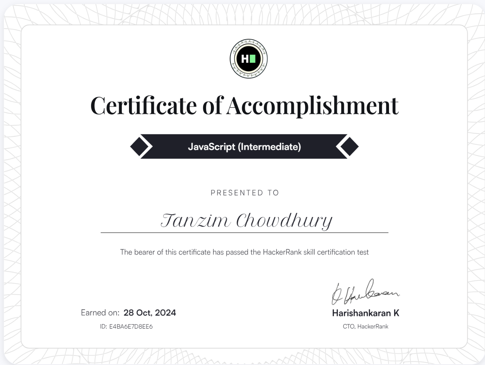
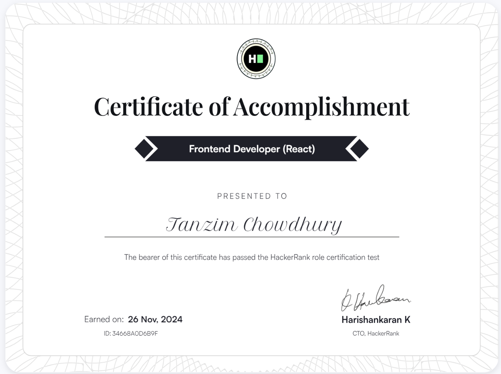
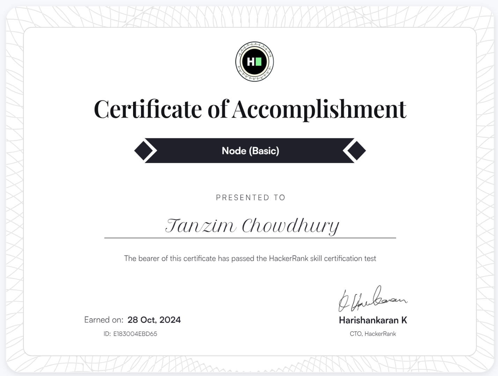

###
 
<h2 align="center">
    Hello! I'm Tanzim - Full-stack SWE
</h2>

<h3>💡 What Drives Me</h3>
<ul>
   <li><b>Problem Solver</b>: I thrive on dissecting complex challenges and crafting efficient, impactful solutions.</li>
   <li><b>Lifelong Learner</b>: Whether it’s the latest tech trends or advanced system designs, I'm always exploring, learning, and improving.</li>
   <li><b>Team Player</b>: I value collaboration, love open-source contributions, and aim to inspire and be inspired by others in the tech community.</li>
</ul>
<h3>💪 The only limit to our realization of tomorrow will be our doubts of today.</h3>
<h3>🌐 Let's Connect</h3>

I'm always excited to connect with fellow developers, learners, and innovators. Feel free to explore my projects, provide feedback, or just say hi! Here is my: <a href="https://www.linkedin.com/in/tanzim-i/">LinkedIn account</a> Let's innovate together! 

<h3> Briefly this is me 👇 </h3>
<table>
  <tr>
    <td valign="top" width="50%">
      
    </td>
    <td valign="top" width="50%">
     
    </td>
  </tr>
</table>

<h3>🏆 Tropheys earned </h3>
  

<h3>🧠 Leetcode stats </h3>
<table>
  <tr>
    <td valign="top">
      
    </td>
    <td valign="top">
     
    </td>
  </tr>
</table>

<h3>📜 Certifications</h3>

  

    
  

  

    
  

  

    
  

